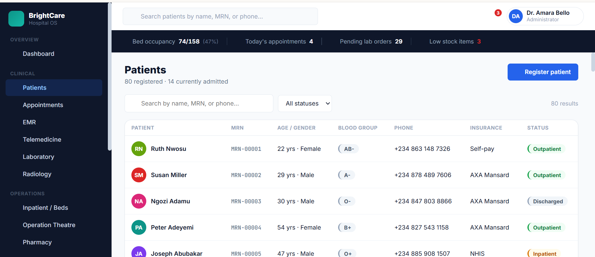
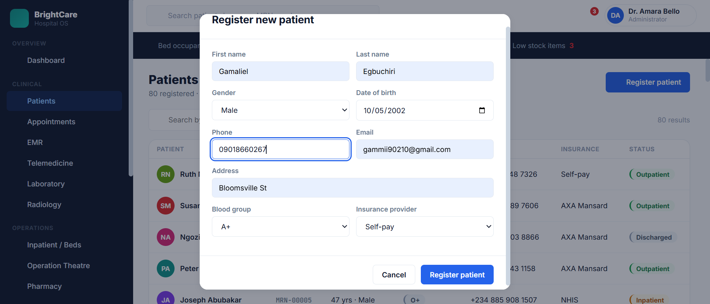
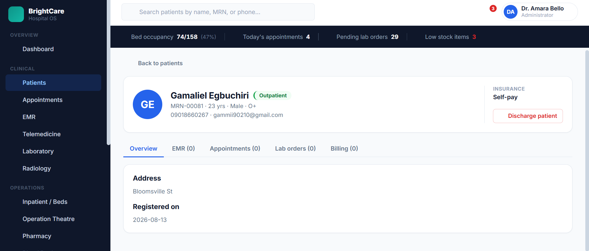
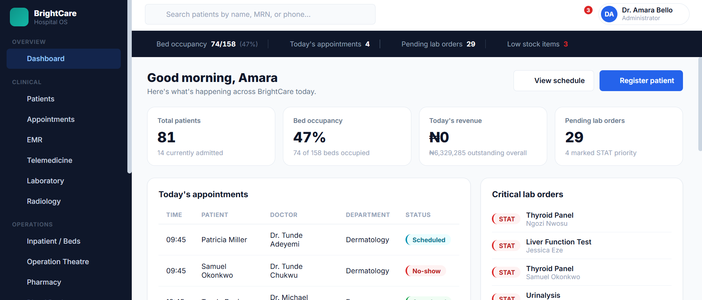
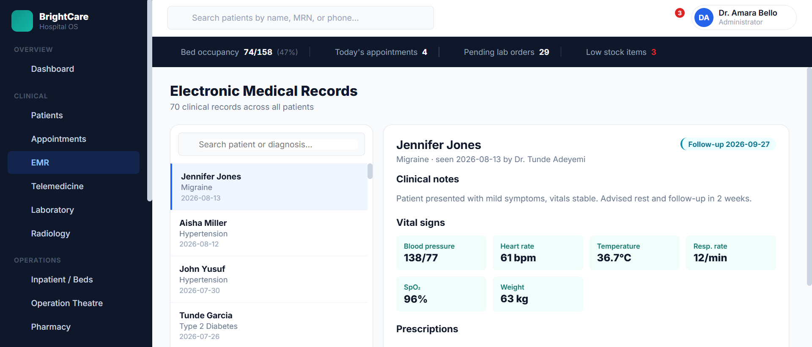
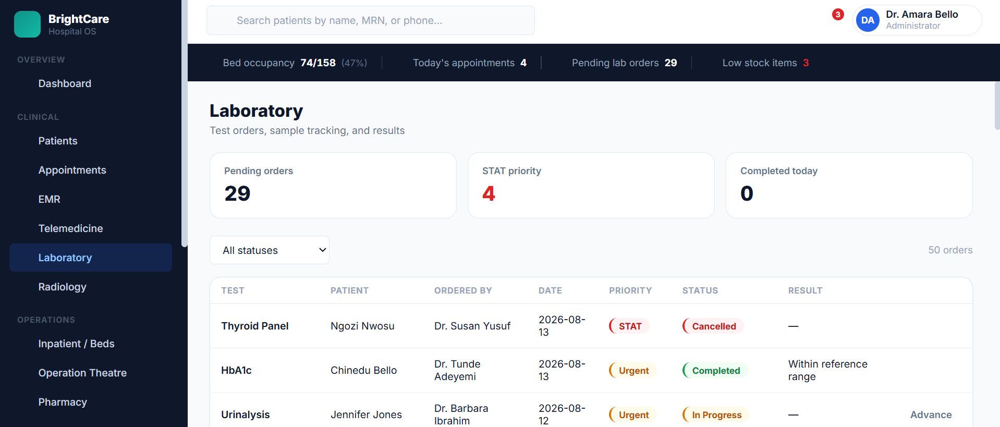
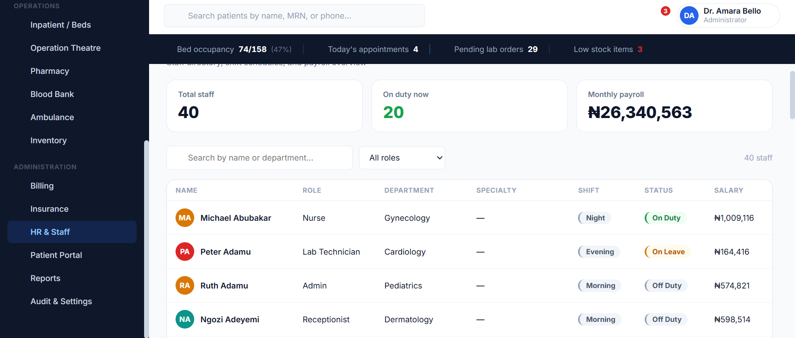
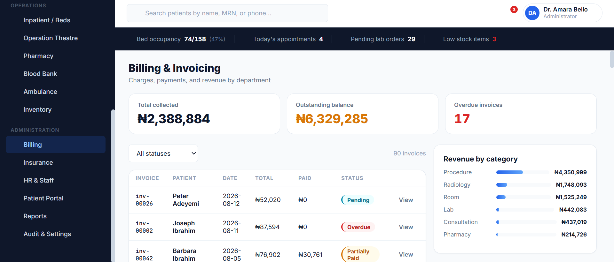

<div align="center">

# 🏥 BrightCare — Hospital OS

**A full-featured Hospital Management System UI built with Angular 19.**
Clean clinical design · Reactive signals · Zero third-party UI libraries

[](https://your-live-url.github.io/brightcare-hms)
[](https://angular.dev)
[](https://www.typescriptlang.org/)
[](#)

---

*README · Educational Project*

| Field | Details |
|---|---|
| **Tech** | Angular 19 (standalone components) · TypeScript · SCSS — zero external UI libraries |
| **State** | Angular Signals (`signal`, `computed`) — no NgRx, no RxJS store |
| **Data** | In-memory mock data generator, seeded on app boot |
| **Currency** | Nigerian Naira (₦) formatting throughout |

> BrightCare is a mock, frontend-only Hospital Operating System covering the full patient journey — registration, clinical records, labs, radiology, billing, pharmacy, HR, and more — built to explore Angular Signals and dashboard-grade UI design with no backend and no component libraries.

</div>

---

## Table of Contents

- [Overview](#overview)
- [Feature Showcase](#feature-showcase)
- [Tech Stack](#tech-stack)
- [Project Structure](#project-structure)
- [Getting Started](#getting-started)
- [Design System](#design-system)
- [Module Breakdown](#module-breakdown)
- [State Management](#state-management)
- [Roadmap](#roadmap)

---

## Overview

**BrightCare** is a fully interactive, frontend-only hospital management system inspired by real-world clinical software. It covers the entire hospital workflow — patient registration and records, appointments, EMR, labs, radiology, inpatient beds, operation theatre, pharmacy, blood bank, ambulance dispatch, billing, insurance, HR & payroll, and audit logs — using only Angular 19 and hand-crafted SCSS.

The app features a persistent sidebar + top navigation shell, a live "census strip" showing bed occupancy, today's appointments, pending labs, and stock alerts, and reactive updates powered by Angular Signals across every module.

---

## Feature Showcase

### Patients — Registry & Search



The **Patients** module lists every registered patient with avatar, MRN, age/gender, blood group, phone, insurance provider, and a colour-coded status chip (**Outpatient**, **Inpatient**, **Emergency**, **Discharged**). A search box filters by name, MRN, or phone, alongside a status dropdown, with a live result count. The header shows a running total of registered vs. currently admitted patients.

---

### Register New Patient



The **Register patient** modal captures first/last name, gender, date of birth, phone, email, address, blood group, and insurance provider. On submit, the patient is instantly created with an auto-generated MRN and appears at the top of the patients table — no page reload required.

---

### Patient Profile — Overview, EMR, Appointments, Labs, Billing



Clicking a patient opens a dedicated profile with a tabbed view:

- **Overview** — address and registration date
- **EMR** — clinical records tied to the patient
- **Appointments** — full visit history and status
- **Lab orders** — tests ordered, priority, and results
- **Billing** — invoices, totals, and payment status

Each patient can be **discharged** directly from their profile via a confirmation-guarded action in the insurance sidebar, which removes them from the active patient list and logs the action to the audit trail.

---

### Dashboard — Hospital at a Glance



The **Dashboard** greets the logged-in user and surfaces the day's key metrics in four summary cards — total patients, bed occupancy, today's revenue, and pending lab orders — followed by a live **Today's appointments** table and a **Critical lab orders** panel highlighting STAT-priority tests.

---

### Electronic Medical Records (EMR)



The **EMR** module lists all clinical records with a searchable patient/diagnosis list on the left. Selecting a record reveals the diagnosis, attending doctor, visit date, follow-up date, free-text clinical notes, a full **vital signs** grid (blood pressure, heart rate, temperature, respiratory rate, SpO₂, weight), and any prescriptions issued.

---

### Laboratory — Orders & Results



The **Laboratory** module tracks pending orders, STAT-priority counts, and orders completed today. The order table lists the test, patient, ordering doctor, date, priority, status (Ordered, In Progress, Completed, Cancelled), and result — filterable by status.

---

### HR & Staff



The **HR & Staff** module summarises total staff, how many are currently on duty, and monthly payroll, then lists every staff member with role, department, specialty, shift, duty status, and salary — searchable by name or department and filterable by role.

---

### Billing & Invoicing



The **Billing & Invoicing** module shows total collected, outstanding balance, and overdue invoice count at a glance, an invoice table (patient, date, total, amount paid, status), and a **Revenue by category** breakdown across procedures, radiology, room charges, lab, consultations, and pharmacy.

---

## Tech Stack

| Layer | Technology |
|---|---|
| Framework | Angular 19 (standalone components) |
| Language | TypeScript 5.7 |
| Styling | SCSS — component-scoped + global design tokens |
| Reactivity | Angular Signals · `computed()` |
| Routing | Angular Router (lazy-loaded feature routes) |
| Data | In-memory mock data generator, seeded on boot |
| Build | Angular CLI (`ng build` / `ng serve`) |
| Testing | Karma + Jasmine |

> No Angular Material, PrimeNG, or any other UI component library is used. Every table, chip, modal, and chart bar is hand-rolled.

---

## Project Structure

```
src/
├── app/
│   ├── core/
│   │   ├── models/
│   │   │   └── models.ts             # Patient, Appointment, Staff, Invoice, etc.
│   │   └── services/
│   │       ├── data-store.service.ts       # Signals, computed metrics, mutations
│   │       └── mock-data.generator.ts      # Seeds all mock collections
│   ├── features/
│   │   ├── dashboard/                # Summary cards, today's appointments, critical labs
│   │   ├── patients/                 # Registry, register modal, patient profile + discharge
│   │   ├── appointments/             # Scheduling and status tracking
│   │   ├── emr/                      # Clinical records and vitals
│   │   ├── telemedicine/             # Virtual consultations
│   │   ├── laboratory/               # Lab orders and results
│   │   ├── radiology/                # Imaging orders
│   │   ├── inpatient/                # Bed occupancy and ward management
│   │   ├── ot/                       # Operation theatre bookings
│   │   ├── pharmacy/                 # Drug stock and dispensing
│   │   ├── bloodbank/                # Blood unit inventory
│   │   ├── ambulance/                # Dispatch tracking
│   │   ├── inventory/                # Hospital asset inventory
│   │   ├── billing/                  # Invoices and revenue breakdown
│   │   ├── insurance/                # Claims management
│   │   ├── hr/                       # Staff directory and payroll
│   │   ├── patient-portal/           # Patient-facing self-service view
│   │   ├── reports/                  # Cross-module analytics
│   │   └── settings/                 # Audit log and app settings
│   ├── layout/
│   │   ├── shell.component.*         # Sidebar, topbar, census strip, router outlet
│   │   └── nav-items.ts              # Navigation groups and routes
│   ├── shared/
│   │   └── icon.component.ts         # Inline SVG icon set
│   ├── app.component.ts              # Root shell bootstrap
│   ├── app.routes.ts                 # Route configuration
│   └── app.config.ts                 # Angular standalone bootstrapping
├── styles.scss                       # Global design tokens, resets, chips, modals
└── index.html
```

---

## Getting Started

**Prerequisites:** Node.js 18+ and npm.

```bash
# 1. Install dependencies
cd hms
npm install

# 2. Start the development server
npm start
# → App runs at http://localhost:4200

# 3. Build for production
npm run build
```

---

## Design System

All visual decisions are derived from a single design token set declared at `:root` in `styles.scss`, so colours, surfaces, and states stay consistent across every module.

```scss
--ink:            #0F172A   /* sidebar / topbar dark surface           */
--surface:        #FFFFFF   /* cards and panels                        */
--canvas:          #F8FAFC   /* page background                        */
--border:         #E2E8F0

--primary:        #2563EB   /* buttons, active nav, links               */
--clinical:       #0D9488   /* brand mark, clinical accents             */
--critical:       #DC2626   /* emergency status, destructive actions    */
--warning:        #D97706   /* inpatient status, low-stock alerts       */
--success:        #16A34A   /* outpatient / completed / paid states     */
--info:           #0891B2   /* scheduled / pending informational states */

--font-ui:        'Inter'
--font-mono:      'JetBrains Mono'   /* MRNs, invoice IDs, currency      */
```

**Status chips** — every status field (patient status, invoice status, lab priority, appointment status) resolves to a colour-coded pill via a small `statusChip()` helper per component, keeping colour logic out of templates.

**Layout shell** — a fixed-width dark sidebar (grouped into *Overview*, *Clinical*, *Operations*, *Administration*), a topbar with global patient search and notifications, and a persistent **census strip** (bed occupancy, today's appointments, pending labs, low-stock alerts) sit above a scrollable routed content area.

---

## Module Breakdown

| Module | Responsibility |
|---|---|
| `ShellComponent` | Root layout: sidebar navigation, topbar search, notifications, census strip |
| `DashboardComponent` | Daily summary cards, today's appointments, critical lab orders |
| `PatientsComponent` | Patient registry, search/filter, register-patient modal |
| `PatientDetailComponent` | Patient profile — overview, EMR, appointments, labs, billing tabs, discharge action |
| `AppointmentsComponent` | Scheduling and appointment status tracking |
| `EmrComponent` | Clinical records, vitals, prescriptions |
| `LaboratoryComponent` | Lab order queue, priority, and results |
| `RadiologyComponent` | Imaging order queue |
| `InpatientComponent` | Bed occupancy and ward assignment |
| `OtComponent` | Operation theatre bookings |
| `PharmacyComponent` | Drug inventory and dispensing |
| `BloodbankComponent` | Blood unit stock by type |
| `AmbulanceComponent` | Dispatch status tracking |
| `InventoryComponent` | Hospital asset inventory |
| `BillingComponent` | Invoices, payments, and revenue by category |
| `InsuranceComponent` | Insurance claims management |
| `HrComponent` | Staff directory, duty status, payroll |
| `PatientPortalComponent` | Patient-facing self-service view |
| `ReportsComponent` | Cross-module analytics |
| `SettingsComponent` | Audit log and app settings |

---

## State Management

All state lives in `DataStoreService` using Angular Signals — no NgRx, no RxJS store.

```
signal<T>()     →  mutable state (patients, staff, invoices, beds, drugs, …)
computed<T>()   →  derived views (bed occupancy %, today's appointments, low stock, …)
```

Key signals:

| Signal | Purpose |
|---|---|
| `patients` | Full patient registry |
| `appointments` | All scheduled/completed appointments |
| `emrRecords` | Clinical records linked to patients and doctors |
| `invoices` | Billing records and payment status |
| `beds` | Inpatient bed occupancy |
| `labOrders` / `radiologyOrders` | Diagnostic order queues |
| `auditLog` | Action history across every mutation |

Mutations (`addPatient`, `dischargePatient`, `markInvoicePaid`, `updateBedStatus`, `dispenseDrug`, etc.) update the relevant signal and write an entry to `auditLog`, giving every write action a traceable audit trail.

`mock-data.generator.ts` seeds all collections on app boot — 80 patients, 40 staff, appointments, EMR records, invoices, lab/radiology orders, insurance claims, OT bookings, ambulance dispatches, and blood bank stock — so the app is fully populated with no backend required.

---

## Roadmap

- [ ] Persistent storage (localStorage or backend API)
- [ ] Role-based access control per user type
- [ ] Real-time bed and appointment updates
- [ ] PDF export for invoices and lab reports
- [ ] Patient portal self-scheduling
- [ ] Charting library integration for Reports
- [ ] Multi-hospital / multi-branch support
- [ ] Authentication and session management

---

<div align="center">

Built with Angular 19 · BrightCare Hospital OS

</div>
